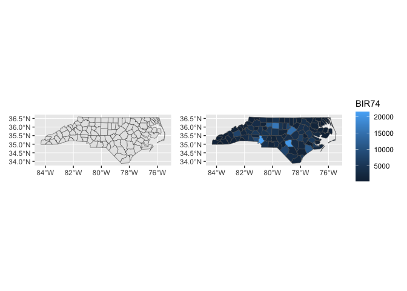
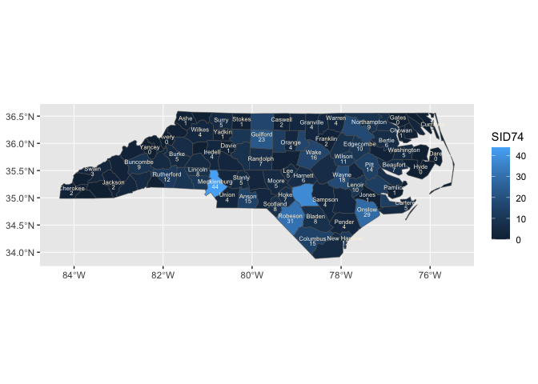

<!-- README.md is generated from README.Rmd. Please edit that file -->

# 0\. ggnorthcarolina

## Installation

You can install the development version of ggnorthcarolina from
[GitHub](https://github.com/) with:

``` r
# install.packages("devtools")
devtools::install_github("EvaMaeRey/ggnorthcarolina")
```

## Example

This is a basic example which shows you how to solve a common problem:

``` r
library(ggnorthcarolina)

northcarolina_flat %>% head()
#>    AREA PERIMETER CNTY_ CNTY_ID        NAME  FIPS FIPSNO CRESS_ID BIR74 SID74
#> 1 0.114     1.442  1825    1825        Ashe 37009  37009        5  1091     1
#> 2 0.061     1.231  1827    1827   Alleghany 37005  37005        3   487     0
#> 3 0.143     1.630  1828    1828       Surry 37171  37171       86  3188     5
#> 4 0.070     2.968  1831    1831   Currituck 37053  37053       27   508     1
#> 5 0.153     2.206  1832    1832 Northampton 37131  37131       66  1421     9
#> 6 0.097     1.670  1833    1833    Hertford 37091  37091       46  1452     7
#>   NWBIR74 BIR79 SID79 NWBIR79
#> 1      10  1364     0      19
#> 2      10   542     3      12
#> 3     208  3616     6     260
#> 4     123   830     2     145
#> 5    1066  1606     3    1197
#> 6     954  1838     5    1237

library(ggplot2)
northcarolina_flat %>%
ggplot() +
  aes(fips = FIPS) +
  geom_sf_countynorthcarolina() ->
A

last_plot() + 
  aes(fill = BIR74) ->
B

library(patchwork)
A + B
#> Joining with `by = join_by(fips)`
#> Joining with `by = join_by(fips)`
```



``` r

northcarolina_flat %>%
ggplot() +
aes(fips = FIPS, 
    fill = SID74,
    label = paste0(NAME, "\n", SID74)) +
  geom_sf_countynorthcarolina() +
  geom_label_northcarolina_county(
    lineheight = .7,
    size = 2, 
    check_overlap= TRUE,
    color = "oldlace")
#> Joining with `by = join_by(fips)`
#> Joining with `by = join_by(fips)`
```



<!-- badges: start -->

<!-- badges: end -->

# 1\. The second-order goal of ggnorthcarolina is to serve as a model and template for other ggplot-based geography-specific convenience mapping packages.

Let’s look at the package contents

``` r
fs::dir_tree(recurse = F)
#> .
#> ├── DESCRIPTION
#> ├── NAMESPACE
#> ├── R
#> ├── README.Rmd
#> ├── README.md
#> ├── data
#> ├── data-raw
#> ├── ggnorthcarolina.Rproj
#> └── man
```

The data-raw and R folder are where all the creative action happens.

``` r
fs::dir_tree(path = "data-raw", recurse = F)
#> data-raw
#> └── DATASET.R
fs::dir_tree(path = "R", recurse = F)
#> R
#> ├── data.R
#> ├── geom.R
#> ├── labels.R
#> ├── stamp.R
#> └── utils-pipe.R
```

# A. Prepare reference datasets

The functions that you create in the R folder will use data that is
prepared in the ./data-raw/DATASET.R file. Let’s have a look at the
contents of that file to get a sense of the preparation.

## ./data-raw/DATASET.R

``` r
## code to prepare `DATASET` dataset goes here


###### 0. Read in shape file data  #####

library(sf)
northcarolina_county_sf <- st_read(system.file("shape/nc.shp", package="sf")) |>
  dplyr::rename(county_name = NAME,
                fips = FIPS)

### save as is if desired #####
usethis::use_data(northcarolina_county_sf, overwrite = TRUE)


#### 1, create polygon reference dataframe w xmin, ymin, xmax and ymax and save
northcarolina_county_reference <- northcarolina_county_sf |>
  ggnc::create_geometries_reference(
                            id_cols = c(county_name, fips))

usethis::use_data(northcarolina_county_reference, overwrite = TRUE)


####### 2. create and save flat file for examples, if desired ####

northcarolina_county_sf %>%
  sf::st_drop_geometry() ->
northcarolina_county_flat

usethis::use_data(northcarolina_county_flat, overwrite = TRUE)

############### 3. create polygon centers and labels reference data frame

# county centers for labeling polygons

northcarolina_county_centers <- northcarolina_county_sf |>
  ggnc::prepare_polygon_labeling_data(id_cols = c(county_name, fips))


usethis::use_data(northcarolina_county_centers, overwrite = TRUE)
```

The prepared data is documented in ./R/data.R

## ./R/data.R

``` r
#' World Health Organization TB data
#'
#' A subset of data from the World Health Organization Global Tuberculosis
#' Report ...
#'
#' @format ## `who`
#' A data frame with 7,240 rows and 60 columns:
#' \describe{
#'   \item{country}{Country name}
#'   \item{iso2, iso3}{2 & 3 letter ISO country codes}
#'   \item{year}{Year}
#'   ...
#' }
#' @source <https://www.who.int/teams/global-tuberculosis-programme/data>
"northcarolina_county_sf"

#' World Health Organization TB data
#'
#' A subset of data from the World Health Organization Global Tuberculosis
#' Report ...
#'
#' @format ## `who`
#' A data frame with 7,240 rows and 60 columns:
#' \describe{
#'   \item{country}{Country name}
#'   \item{iso2, iso3}{2 & 3 letter ISO country codes}
#'   \item{year}{Year}
#'   ...
#' }
#' @source <https://www.who.int/teams/global-tuberculosis-programme/data>
"northcarolina_county_flat"


#' World Health Organization TB data
#'
#' A subset of data from the World Health Organization Global Tuberculosis
#' Report ...
#'
#' @format ## `who`
#' A data frame with 7,240 rows and 60 columns:
#' \describe{
#'   \item{country}{Country name}
#'   \item{iso2, iso3}{2 & 3 letter ISO country codes}
#'   \item{year}{Year}
#'   ...
#' }
#' @source <https://www.who.int/teams/global-tuberculosis-programme/data>
"northcarolina_county_centers"

#' World Health Organization TB data
#'
#' A subset of data from the World Health Organization Global Tuberculosis
#' Report ...
#'
#' @format ## `who`
#' A data frame with 7,240 rows and 60 columns:
#' \describe{
#'   \item{country}{Country name}
#'   \item{iso2, iso3}{2 & 3 letter ISO country codes}
#'   \item{year}{Year}
#'   ...
#' }
#' @source <https://www.who.int/teams/global-tuberculosis-programme/data>
"northcarolina_county_reference"
```

# B. Prepare functions for building polygons defined by ids

## ./R/geom.R

``` r
################# Compute panel function ###########

#' Title
#'
#' @param data
#' @param scales
#' @param keep_county
#'
#' @return
#' @export
#'
#' @examples
#' library(dplyr)
#' #northcarolina_flat |> rename(fips = FIPS) |> compute_county_northcarolina() |> head()
#' #northcarolina_flat |> rename(fips = FIPS) |> compute_county_northcarolina(keep_county = "Ashe")
compute_county_northcarolina <- function(data, scales, keep_county = NULL){

  reference_filtered <- northcarolina_county_reference
  #
  if(!is.null(keep_county)){

    keep_county %>% tolower() -> keep_county

    reference_filtered %>%
      dplyr::filter(.data$county_name %>%
                      tolower() %in%
                      keep_county) ->
      reference_filtered

  }

  # to prevent overjoining
  reference_filtered %>%
    dplyr::select("fips", "geometry", "xmin",
                  "xmax", "ymin", "ymax") ->
    reference_filtered


  data %>%
    dplyr::inner_join(reference_filtered) %>% # , by = join_by(fips)
    dplyr::mutate(group = -1) %>%
    dplyr::select(-fips) #%>%
    # sf::st_as_sf() %>%
    # sf::st_transform(crs = 5070)

}


###### Specify ggproto ###############

StatCountynorthcarolina <- ggplot2::ggproto(`_class` = "StatCountynorthcarolina",
                               `_inherit` = ggplot2::Stat,
                               compute_panel = compute_county_northcarolina,
                               default_aes = ggplot2::aes(geometry =
                                                            ggplot2::after_stat(geometry)))


########### geom function, inherits from sf ##################

#' Title
#'
#' @param mapping
#' @param data
#' @param position
#' @param na.rm
#' @param show.legend
#' @param inherit.aes
#' @param ...
#'
#' @return
#' @export
#'
#' @examples
#' library(ggplot2)
#' northcarolina_flat %>%
#' ggplot() +
#' aes(fips = FIPS) +
#' geom_sf_countynorthcarolina()
geom_sf_countynorthcarolina <- function(
                                 mapping = NULL,
                                 data = NULL,
                                 position = "identity",
                                 na.rm = FALSE,
                                 show.legend = NA,
                                 inherit.aes = TRUE,
                                 crs = "NAD27", # "NAD27", 5070, "WGS84", "NAD83", 4326 , 3857
                                 ...
                                 ) {

                                 c(ggplot2::layer_sf(
                                   stat = StatCountynorthcarolina,  # proto object from step 2
                                   geom = ggplot2::GeomSf,  # inherit other behavior
                                   data = data,
                                   mapping = mapping,
                                   position = position,
                                   show.legend = show.legend,
                                   inherit.aes = inherit.aes,
                                   params = rlang::list2(na.rm = na.rm, ...)),
                                   coord_sf(crs = crs,
                                            default_crs = sf::st_crs(crs),
                                            datum = crs,
                                            default = TRUE)
                                 )

}
```

## ./R/stamp.R

``` r
#' Title
#'
#' @param data
#' @param scales
#' @param county
#'
#' @return
#' @export
#'
#' @examples
#' library(dplyr)
#' #northcarolina_flat |> rename(fips = FIPS) |> compute_county_northcarolina() |> head() |> str()
#' #northcarolina_flat |> rename(fips = FIPS) |> compute_county_northcarolina(keep_county = "Ashe")
compute_county_northcarolina_stamp <- function(data, scales, keep_county = NULL){

  reference_filtered <- northcarolina_county_reference
  #
  if(!is.null(keep_county)){

    keep_county %>% tolower() -> keep_county

    reference_filtered %>%
      dplyr::filter(.data$county_name %>%
                      tolower() %in%
                      keep_county) ->
      reference_filtered

  }

  reference_filtered %>%
    dplyr::select("fips", "geometry", "xmin",
                  "xmax", "ymin", "ymax") ->
    reference_filtered


  reference_filtered %>%
    dplyr::mutate(group = -1) %>%
    dplyr::select(-fips)

}


StatCountynorthcarolinastamp <- ggplot2::ggproto(`_class` = "StatCountynorthcarolinastamp",
                               `_inherit` = ggplot2::Stat,
                               compute_panel = compute_county_northcarolina_stamp,
                               default_aes = ggplot2::aes(geometry =
                                                            ggplot2::after_stat(geometry)))


#' Title
#'
#' @param mapping
#' @param data
#' @param position
#' @param na.rm
#' @param show.legend
#' @param inherit.aes
#' @param ...
#'
#' @return
#' @export
#'
#' @examples
#' library(ggplot2)
#' ggplot() +
#' stamp_sf_countynorthcarolina()
stamp_sf_countynorthcarolina <- function(
                                 mapping = NULL,
                                 data = reference_full,
                                 position = "identity",
                                 na.rm = FALSE,
                                 show.legend = NA,
                                 inherit.aes = TRUE,
                                 crs = "NAD27", #WGS84, NAD83
                                 ...
                                 ) {

                                 c(ggplot2::layer_sf(
                                   stat = StatCountynorthcarolinastamp,  # proto object from step 2
                                   geom = ggplot2::GeomSf,  # inherit other behavior
                                   data = data,
                                   mapping = mapping,
                                   position = position,
                                   show.legend = show.legend,
                                   inherit.aes = inherit.aes,
                                   params = rlang::list2(na.rm = na.rm, ...)),
                                   coord_sf(crs = crs,
                                            # default_crs = sf::st_crs(crs),
                                            # datum = sf::st_crs(crs),
                                            default = TRUE)
                                 )

}
```

## ./R/labels.R

``` r
# step 00 reference data
# northcarolina_county_centers <- data.frame(     x   =  -81.49496,   y = 36.42112,  county_name = "Ashe",   fips = "37009")


# step 1
#' Title
#'
#' @param data
#' @param scales
#' @param keep_county
#'
#' @return
#' @export
#'
#' @examples
#' northcarolina_flat |>
#'   dplyr::rename(fips = FIPS) |>
#'   dplyr::rename(label = NAME) |>
#'   compute_panel_county_centers()
compute_panel_county_centers <- function(data,
                                         scales,
                                         keep_county = NULL){

  northcarolina_county_centers_filtered <- northcarolina_county_centers

  if(!is.null(keep_county)){
    keep_county %>% tolower() -> keep_county

    northcarolina_county_centers_filtered %>%
      dplyr::filter(.data$county_name %>%
                      tolower() %in%
                      keep_county) ->
      northcarolina_county_centers_filtered}

  data %>%
    dplyr::inner_join(northcarolina_county_centers_filtered) %>%
    dplyr::select(x, y, label)

}


# step 2 proto
StatCountycenters <- ggplot2::ggproto(
  `_class` = "StatRownumber",
  `_inherit` = ggplot2::Stat,
  # required_aes = c("label"), # for some reason this breaks things... why?
  compute_panel = compute_panel_county_centers
)

#' Title
#'
#' @param mapping
#' @param data
#' @param position
#' @param na.rm
#' @param show.legend
#' @param inherit.aes
#' @param ...
#'
#' @return
#' @export
#'
#' @examples
#' library(ggplot2)
#' northcarolina_flat %>%
#'  ggplot() +
#'  aes(fips = FIPS, label = NAME) +
#'  geom_label_northcarolina_county()
#'
#' northcarolina_flat %>%
#'  ggplot() +
#'  aes(fips = FIPS, label = NAME) +
#'  geom_sf_countynorthcarolina() +
#'  geom_label_northcarolina_county()
#'
#'  northcarolina_flat %>%
#'  ggplot() +
#'  aes(fips = FIPS, label = SID74, fill = SID74) +
#'  geom_sf_countynorthcarolina() +
#'  geom_label_northcarolina_county(color = "oldlace")
#'
#'  northcarolina_flat %>%
#'  ggplot() +
#'  aes(fips = FIPS, fill = SID74,
#'      label = paste0(NAME, "\n", SID74)) +
#'  geom_sf_countynorthcarolina() +
#'  geom_label_northcarolina_county(lineheight = .7,
#'  size = 2, check_overlap= TRUE,
#'  color = "oldlace")
geom_label_northcarolina_county <- function(
  mapping = NULL,
  data = NULL,
  position = "identity",
  na.rm = FALSE,
  show.legend = NA,
  inherit.aes = TRUE, ...) {
  ggplot2::layer(
    stat = StatCountycenters,  # proto object from Step 2
    geom = ggplot2::GeomText,  # inherit other behavior
    data = data,
    mapping = mapping,
    position = position,
    show.legend = show.legend,
    inherit.aes = inherit.aes,
    params = list(na.rm = na.rm, ...)
  )
}
```
