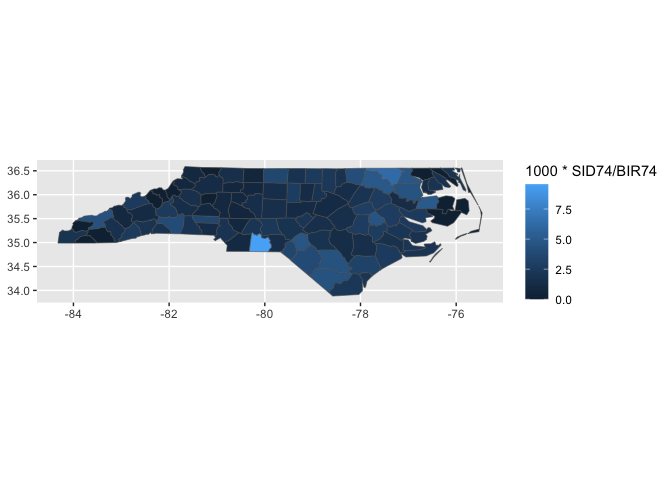
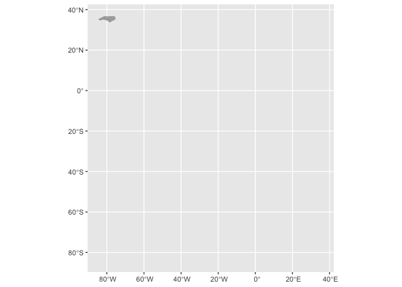
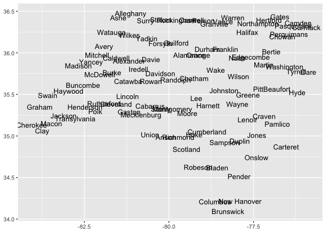

  - [{ggnorthcarolina}](#ggnorthcarolina)
      - [Installation](#installation)
      - [example: NC choropleth made
        easy](#example-nc-choropleth-made-easy)
      - [example with labels.](#example-with-labels)
  - [How we built this functionality](#how-we-built-this-functionality)
      - [Step 000. Find an appropriate shape
        file](#step-000-find-an-appropriate-shape-file)
      - [Step 00. Build the map with base ggplot2 and
        geom\_sf](#step-00-build-the-map-with-base-ggplot2-and-geom_sf)
  - [Step 0. Prepare reference
    datasets.](#step-0-prepare-reference-datasets)
      - [0.i geographic dataset
        collection/preparation](#0i-geographic-dataset-collectionpreparation)
      - [0.ii dataset documentation](#0ii-dataset-documentation)
  - [Write functions w/ ‘recipe’ substeps: 1. compute\_panel; 2. define
    ggproto; 3. write geom\_\*; 4.
    test.](#write-functions-w-recipe-substeps-1-compute_panel-2-define-ggproto-3-write-geom_-4-test)
      - [Write `geom_county()`](#write-geom_county)
      - [Write `stamp_county()`](#write-stamp_county)
      - [Write `geom_county_labels()`](#write-geom_county_labels)
  - [Part 2. Packaging and documentation 🚧
    ✅](#part-2-packaging-and-documentation--)
      - [minimal requirements for github package. Have
        you:](#minimal-requirements-for-github-package-have-you)
          - [Created files for package archetecture with
            `devtools::create("./ggbarlabs")`
            ✅](#created-files-for-package-archetecture-with-devtoolscreateggbarlabs-)
          - [Moved functions R folder? ✅](#moved-functions-r-folder-)
          - [Added roxygen skeleton? ✅](#added-roxygen-skeleton-)
          - [Managed dependencies ? ✅](#managed-dependencies--)
          - [Chosen a license? ✅](#chosen-a-license-)
          - [Run `devtools::check()` and addressed errors?
            ✅](#run-devtoolscheck-and-addressed-errors-)
      - [Listen 🚧](#listen-)
          - [Consulted with potential users
            🚧](#consulted-with-potential-users-)
          - [Consulted with technical
            experts](#consulted-with-technical-experts)
      - [Polish. Have you…](#polish-have-you)
          - [Settled on examples and put them in the roxygen skeleton?
            🚧](#settled-on-examples-and-put-them-in-the-roxygen-skeleton-)
          - [Written formal tests of functions?
            🚧](#written-formal-tests-of-functions-)
          - [Sent tests in this readme to package via readme2pkg
            🚧](#sent-tests-in-this-readme-to-package-via-readme2pkg-)
          - [Have you worked added a description and author information
            in the DESCRIPTION file?
            🚧](#have-you-worked-added-a-description-and-author-information-in-the-description-file-)
          - [Addressed *all* notes, warnings and errors.
            🚧](#addressed-all-notes-warnings-and-errors-)
      - [Promote](#promote)
          - [Package website built? 🚧](#package-website-built-)
          - [Package website deployed? 🚧](#package-website-deployed-)
      - [Harden](#harden)
          - [Submit to CRAN? 🚧](#submit-to-cran-)
  - [Reports, Environment](#reports-environment)
      - [Description file extract](#description-file-extract)
      - [Environment](#environment)
      - [`devtools::check()` report](#devtoolscheck-report)
  - [Install development package with
    `devtools::build()`](#install-development-package-with-devtoolsbuild)
      - [Repo Directory and files
        report](#repo-directory-and-files-report)
          - [](#section)
          - [Changing context](#changing-context)

<!-- README.md is generated from README.Rmd. Please edit that file -->

# {ggnorthcarolina}

ggnorthcarolina allows you to create informative county maps straight
from a flat tabular data file. i.e. a file that has the county id in
column as well as characteristics about the counties to be represented
by fill color for example.

## Installation

You can install the development version of ggnorthcarolina from
[GitHub](https://github.com/) with:

``` r
# install.packages("devtools")
devtools::install_github("EvaMaeRey/ggnorthcarolina")
```

## example: NC choropleth made easy

North Carolina county characteristics data, and wanting to map that
data, but not having experience with boundary files or just not wanting
to think about joins to use a geom\_sf() layer.

``` r
library(tidyverse)
library(ggnorthcarolina)
```

With ggnorthcarolina, voila, choropleth\!

``` r
library(ggnorthcarolina)
library(ggplot2)
northcarolina_flat %>%
ggplot() +
  aes(fips = FIPS) +
  geom_county() ->
A

last_plot() + 
  aes(fill = BIR74) ->
B

library(patchwork)
A + B
#> Joining with `by = join_by(fips)`
#> Joining with `by = join_by(fips)`
```


And here is the input dataset, which is indeed just a tabular, flat
dataset. It has no boundary information

``` r
northcarolina_flat %>% head()
#>    AREA PERIMETER CNTY_ CNTY_ID        NAME  FIPS FIPSNO CRESS_ID BIR74 SID74
#> 1 0.114     1.442  1825    1825        Ashe 37009  37009        5  1091     1
#> 2 0.061     1.231  1827    1827   Alleghany 37005  37005        3   487     0
#> 3 0.143     1.630  1828    1828       Surry 37171  37171       86  3188     5
#> 4 0.070     2.968  1831    1831   Currituck 37053  37053       27   508     1
#> 5 0.153     2.206  1832    1832 Northampton 37131  37131       66  1421     9
#> 6 0.097     1.670  1833    1833    Hertford 37091  37091       46  1452     7
#>   NWBIR74 BIR79 SID79 NWBIR79
#> 1      10  1364     0      19
#> 2      10   542     3      12
#> 3     208  3616     6     260
#> 4     123   830     2     145
#> 5    1066  1606     3    1197
#> 6     954  1838     5    1237
```

By declaring the aesthetic fips, the geom\_ function joins the flat file
to boundary data and an SF layer is plotted.

## example with labels.

Furthermore, we also make labeling these polygons easy:

``` r
northcarolina_flat %>%
ggplot() +
aes(fips = FIPS, 
    fill = SID74,
    label = paste0(NAME, "\n", SID74)) +
  geom_county() +
  geom_county_label(
    lineheight = .8,
    size = 2, 
    check_overlap= TRUE,
    color = "oldlace")
#> Joining with `by = join_by(fips)`
#> Joining with `by = join_by(fips)`
```



<!-- badges: start -->

<!-- badges: end -->

# How we built this functionality

The second-order goal of ggnorthcarolina is to serve as a model and
template for other ggplot-based geography-specific convenience mapping
packages. Because of this, and because the package is generally new and
could use other sets of eyes on pretty much every decision, I’m using a
literate programming paradigm to write a narrative for this package.

## Step 000. Find an appropriate shape file

A prerequisite to embarking on the following journey is that you have
geographic data that you’d like to connect up to a flat file for mapping
within ggplot2. In our case, for convenience, we use nc.shp provided in
the sf package. You’ll see that file read in as an sf object later with
the following code.

Such a shape file can live in the data-raw folder, or can be accessed
from another package:

    st_read(system.file("shape/nc.shp", package="sf")) 

## Step 00. Build the map with base ggplot2 and geom\_sf

This doesn’t show all the pain that you will actually be in if you want
to create a choropleth. Because we are working with an object that
already has geometries as a list-column. If you were working with a flat
file (which is the imagined )

``` r
sf::st_read(system.file("shape/nc.shp", package="sf")) |>
  data.frame() |>
  dplyr::select(FIPS, NAME, geometry) ->
id_and_boundaries
#> Reading layer `nc' from data source 
#>   `/Library/Frameworks/R.framework/Versions/4.2/Resources/library/sf/shape/nc.shp' 
#>   using driver `ESRI Shapefile'
#> Simple feature collection with 100 features and 14 fields
#> Geometry type: MULTIPOLYGON
#> Dimension:     XY
#> Bounding box:  xmin: -84.32385 ymin: 33.88199 xmax: -75.45698 ymax: 36.58965
#> Geodetic CRS:  NAD27

# ggnorthcarolina::nc_flat |>
#   dplyr::left_join(id_and_boundaries, by = "FIPS") |>
#   ggplot() + 
#   geom_sf() + 
#   aes(fill = SID74 / BIR74)
```

# Step 0. Prepare reference datasets.

The functions that you create in the R folder will use data that is
prepared in the ./data-raw/DATASET.R file. Let’s have a look at the
contents of that file to get a sense of the preparation. Functions in
the {ggnc} package will help you prepare the reference data that is
required. Keep an eye out for `ggnc::create_geometries_reference()` and
`ggnc::prepare_polygon_labeling_data()`.

ggnc is available on git hub as shown:

``` r
remotes::install_github("EvaMaeRey/ggnc")
```

## 0.i geographic dataset collection/preparation

``` r
## code to prepare `DATASET` dataset goes here


###### 0. Read in shape file data  #####

library(sf)
northcarolina_county_sf <- st_read(system.file("shape/nc.shp", package="sf")) |>
  dplyr::rename(county_name = NAME,
                fips = FIPS)

### save as is if desired #####
usethis::use_data(northcarolina_county_sf, overwrite = TRUE)


#### 1, create polygon reference dataframe w xmin, ymin, xmax and ymax and save
northcarolina_county_reference <- northcarolina_county_sf |>
  ggnc::create_geometries_reference(
                            id_cols = c(county_name, fips))

usethis::use_data(northcarolina_county_reference, overwrite = TRUE)


####### 2. create and save flat file for examples, if desired ####

northcarolina_county_sf %>%
  sf::st_drop_geometry() ->
northcarolina_county_flat

usethis::use_data(northcarolina_county_flat, overwrite = TRUE)

############### 3. create polygon centers and labels reference data frame

# county centers for labeling polygons

northcarolina_county_centers <- northcarolina_county_sf |>
  ggnc::prepare_polygon_labeling_data(id_cols = c(county_name, fips))


usethis::use_data(northcarolina_county_centers, overwrite = TRUE)
```

Here are a few rows of each dataset that’s created

``` r
nc_flat %>% head()
#>    AREA PERIMETER CNTY_ CNTY_ID        NAME  FIPS FIPSNO CRESS_ID BIR74 SID74
#> 1 0.114     1.442  1825    1825        Ashe 37009  37009        5  1091     1
#> 2 0.061     1.231  1827    1827   Alleghany 37005  37005        3   487     0
#> 3 0.143     1.630  1828    1828       Surry 37171  37171       86  3188     5
#> 4 0.070     2.968  1831    1831   Currituck 37053  37053       27   508     1
#> 5 0.153     2.206  1832    1832 Northampton 37131  37131       66  1421     9
#> 6 0.097     1.670  1833    1833    Hertford 37091  37091       46  1452     7
#>   NWBIR74 BIR79 SID79 NWBIR79
#> 1      10  1364     0      19
#> 2      10   542     3      12
#> 3     208  3616     6     260
#> 4     123   830     2     145
#> 5    1066  1606     3    1197
#> 6     954  1838     5    1237
northcarolina_county_reference %>% head()
#>   county_name  fips      xmin     ymin      xmax     ymax
#> 1        Ashe 37009 -81.74107 36.23436 -81.23989 36.58965
#> 2   Alleghany 37005 -81.34754 36.36536 -80.90344 36.57286
#> 3       Surry 37171 -80.96577 36.23388 -80.43531 36.56521
#> 4   Currituck 37053 -76.33025 36.07282 -75.77316 36.55716
#> 5 Northampton 37131 -77.90121 36.16277 -77.07531 36.55629
#> 6    Hertford 37091 -77.21767 36.23024 -76.70750 36.55629
#>                         geometry
#> 1 MULTIPOLYGON (((-81.47276 3...
#> 2 MULTIPOLYGON (((-81.23989 3...
#> 3 MULTIPOLYGON (((-80.45634 3...
#> 4 MULTIPOLYGON (((-76.00897 3...
#> 5 MULTIPOLYGON (((-77.21767 3...
#> 6 MULTIPOLYGON (((-76.74506 3...
nc_county_centers %>% head()
#>           x        y county_name  fips
#> 1 -81.49496 36.42112        Ashe 37009
#> 2 -81.13241 36.47396   Alleghany 37005
#> 3 -80.69280 36.38828       Surry 37171
#> 4 -75.93852 36.30697   Currituck 37053
#> 5 -77.36988 36.35211 Northampton 37131
#> 6 -77.04217 36.39709    Hertford 37091
```

## 0.ii dataset documentation

Now you’ll also want to document that data. Minimal documentation is
just to quote the object that should be included in your package.

But `northcarolina_county_sf` has template text to show you how to
document this more correctly (I haven’t change out the WHO example I got
elsewhere.)

``` r
#' World Health Organization TB data
#'
#' A subset of data from the World Health Organization Global Tuberculosis
#' Report ...
#'
#' @format ## `who`
#' A data frame with 7,240 rows and 60 columns:
#' \describe{
#'   \item{country}{Country name}
#'   \item{iso2, iso3}{2 & 3 letter ISO country codes}
#'   \item{year}{Year}
#'   ...
#' }
#' @source <https://www.who.int/teams/global-tuberculosis-programme/data>
"northcarolina_county_sf"
#> [1] "northcarolina_county_sf"

"northcarolina_county_flat"
#> [1] "northcarolina_county_flat"

"northcarolina_county_centers"
#> [1] "northcarolina_county_centers"

"northcarolina_county_reference"
#> [1] "northcarolina_county_reference"
```

# Write functions w/ ‘recipe’ substeps: 1. compute\_panel; 2. define ggproto; 3. write geom\_\*; 4. test.

## Write `geom_county()`

``` r
################# Step 1. Compute panel function ###########

#' Title
#'
#' @param data
#' @param scales
#' @param keep_county
#'
#' @return
#' @export
#'
#' @examples
#' library(dplyr)
#' #northcarolina_flat |> rename(fips = FIPS) |> compute_county_northcarolina() |> head()
#' #northcarolina_flat |> rename(fips = FIPS) |> compute_county_northcarolina(keep_county = "Ashe")
compute_county_northcarolina <- function(data, scales, keep_county = NULL){

  reference_filtered <- northcarolina_county_reference
  #
  if(!is.null(keep_county)){

    keep_county %>% tolower() -> keep_county

    reference_filtered %>%
      dplyr::filter(.data$county_name %>%
                      tolower() %in%
                      keep_county) ->
      reference_filtered

  }
#
#   # to prevent overjoining
#   reference_filtered %>%
#     dplyr::select("fips",  # id columns
#                   "geometry",
#                   "xmin","xmax",
#                   "ymin", "ymax") ->
#     reference_filtered


  data %>%
    dplyr::inner_join(reference_filtered) #%>% # , by = join_by(fips)
    # dplyr::mutate(group = -1) %>%
    # dplyr::select(-fips) #%>%
    # sf::st_as_sf() %>%
    # sf::st_transform(crs = 5070)

}


###### Step 2. Specify ggproto ###############

StatCountynorthcarolina <- ggplot2::ggproto(
  `_class` = "StatCountynorthcarolina",
  `_inherit` = ggplot2::Stat,
  compute_panel = compute_county_northcarolina,
  default_aes = ggplot2::aes(geometry = ggplot2::after_stat(geometry)))


########### Step 3. geom function, inherits from sf ##################

#' Title
#'
#' @param mapping
#' @param data
#' @param position
#' @param na.rm
#' @param show.legend
#' @param inherit.aes
#' @param ...
#'
#' @return
#' @export
#'
#' @examples
geom_county <- function(
      mapping = NULL,
      data = NULL,
      position = "identity",
      na.rm = FALSE,
      show.legend = NA,
      inherit.aes = TRUE,
      crs = "NAD27", # "NAD27", 5070, "WGS84", "NAD83", 4326 , 3857
      ...) {
            c(ggplot2::layer_sf(
              stat = StatCountynorthcarolina,  # proto object from step 2
              geom = ggplot2::GeomSf,  # inherit other behavior
              data = data,
              mapping = mapping,
              position = position,
              show.legend = show.legend,
              inherit.aes = inherit.aes,
              params = rlang::list2(na.rm = na.rm, ...)),
              coord_sf(crs = crs,
                       default_crs = sf::st_crs(crs),
                       datum = crs,
                       default = TRUE)
            )
  }
```

``` r
library(ggplot2)
northcarolina_flat %>%
ggplot() +
aes(fips = FIPS) +
geom_county()
#> Joining with `by = join_by(fips)`
```



## Write `stamp_county()`

``` r
################# Step 1. Compute panel function ###########

#' Title
#'
#' @param data
#' @param scales
#' @param county
#'
#' @return
#' @export
#'
#' @examples
#' library(dplyr)
#' #northcarolina_flat |> rename(fips = FIPS) |> compute_county_northcarolina() |> head() |> str()
#' #northcarolina_flat |> rename(fips = FIPS) |> compute_county_northcarolina(keep_county = "Ashe")
compute_county_northcarolina_stamp <- function(data, scales, keep_county = NULL){

  reference_filtered <- northcarolina_county_reference
  #
  if(!is.null(keep_county)){

    keep_county %>% tolower() -> keep_county

    reference_filtered %>%
      dplyr::filter(.data$county_name %>%
                      tolower() %in%
                      keep_county) ->
      reference_filtered

  }

  reference_filtered %>%
    dplyr::select("fips", "geometry", "xmin",
                  "xmax", "ymin", "ymax") ->
    reference_filtered


  reference_filtered %>%
    dplyr::mutate(group = -1) %>%
    dplyr::select(-fips)

}

###### Step 2. Specify ggproto ###############


StatCountynorthcarolinastamp <- ggplot2::ggproto(`_class` = "StatCountynorthcarolinastamp",
                               `_inherit` = ggplot2::Stat,
                               compute_panel = compute_county_northcarolina_stamp,
                               default_aes = ggplot2::aes(geometry =
                                                            ggplot2::after_stat(geometry)))


########### Step 3. 'stamp' function, inherits from sf ##################

#' Title
#'
#' @param mapping
#' @param data
#' @param position
#' @param na.rm
#' @param show.legend
#' @param inherit.aes
#' @param ...
#'
#' @return
#' @export
#'
#' @examples
stamp_county <- function(
                                 mapping = NULL,
                                 data = reference_full,
                                 position = "identity",
                                 na.rm = FALSE,
                                 show.legend = NA,
                                 inherit.aes = TRUE,
                                 crs = "NAD27", #WGS84, NAD83
                                 ...
                                 ) {

                                 c(ggplot2::layer_sf(
                                   stat = StatCountynorthcarolinastamp,  # proto object from step 2
                                   geom = ggplot2::GeomSf,  # inherit other behavior
                                   data = data,
                                   mapping = mapping,
                                   position = position,
                                   show.legend = show.legend,
                                   inherit.aes = inherit.aes,
                                   params = rlang::list2(na.rm = na.rm, ...)),
                                   coord_sf(crs = crs,
                                            # default_crs = sf::st_crs(crs),
                                            # datum = sf::st_crs(crs),
                                            default = TRUE)
                                 )

}
```

``` r
ggplot() +
 stamp_county()
```


## Write `geom_county_labels()`

``` r


################# Step 1. Compute panel function ###########

#' Title
#'
#' @param data
#' @param scales
#' @param keep_county
#'
#' @return
#' @export
#'
#' @examples
compute_panel_county_centers <- function(data,
                                         scales,
                                         keep_county = NULL){

  northcarolina_county_centers_filtered <- northcarolina_county_centers

  if(!is.null(keep_county)){
    keep_county %>% tolower() -> keep_county

    northcarolina_county_centers_filtered %>%
      dplyr::filter(.data$county_name %>%
                      tolower() %in%
                      keep_county) ->
      northcarolina_county_centers_filtered}

  data %>%
    dplyr::inner_join(northcarolina_county_centers_filtered) %>%
    dplyr::select(x, y, label)

}

###### Step 2. Specify ggproto ###############
StatCountycenters <- ggplot2::ggproto(
  `_class` = "StatRownumber",
  `_inherit` = ggplot2::Stat,
  # required_aes = c("label"), # for some reason this breaks things... why?
  compute_panel = compute_panel_county_centers
)


########### Step 3. 'stamp' function, inherits from sf ##################

#' Title
#'
#' @param mapping
#' @param data
#' @param position
#' @param na.rm
#' @param show.legend
#' @param inherit.aes
#' @param ...
#'
#' @return
#' @export
#'
#' @examples
geom_county_label <- function(
  mapping = NULL,
  data = NULL,
  position = "identity",
  na.rm = FALSE,
  show.legend = NA,
  inherit.aes = TRUE, ...) {
  ggplot2::layer(
    stat = StatCountycenters,  # proto object from Step 2
    geom = ggplot2::GeomText,  # inherit other behavior
    data = data,
    mapping = mapping,
    position = position,
    show.legend = show.legend,
    inherit.aes = inherit.aes,
    params = list(na.rm = na.rm, ...)
  )
}
```

``` r
northcarolina_flat |>
  dplyr::rename(fips = FIPS) |>
  dplyr::rename(label = NAME) |>
  compute_panel_county_centers() |> 
  head()
#> Joining with `by = join_by(fips)`
#>           x        y       label
#> 1 -81.49496 36.42112        Ashe
#> 2 -81.13241 36.47396   Alleghany
#> 3 -80.69280 36.38828       Surry
#> 4 -75.93852 36.30697   Currituck
#> 5 -77.36988 36.35211 Northampton
#> 6 -77.04217 36.39709    Hertford
```

``` r
library(ggplot2)
northcarolina_flat %>%
 ggplot() +
 aes(fips = FIPS, label = NAME) +
 geom_county_label()
#> Joining with `by = join_by(fips)`
```



``` r

northcarolina_flat %>%
 ggplot() +
 aes(fips = FIPS, label = NAME) +
 geom_county() +
 geom_county_label()
#> Joining with `by = join_by(fips)`
#> Joining with `by = join_by(fips)`
```


``` r

 northcarolina_flat %>%
 ggplot() +
 aes(fips = FIPS, label = SID74, fill = SID74) +
 geom_county() +
 geom_county_label(color = "oldlace")
#> Joining with `by = join_by(fips)`
#> Joining with `by = join_by(fips)`
```


``` r

 northcarolina_flat %>%
 ggplot() +
 aes(fips = FIPS, fill = SID74,
     label = paste0(NAME, "\n", SID74)) +
 geom_county() +
 geom_county_label(lineheight = .7,
 size = 2, check_overlap= TRUE,
 color = "oldlace")
#> Joining with `by = join_by(fips)`
#> Joining with `by = join_by(fips)`
```


# Part 2. Packaging and documentation 🚧 ✅

## minimal requirements for github package. Have you:

### Created files for package archetecture with `devtools::create("./ggbarlabs")` ✅

### Moved functions R folder? ✅

``` r
library(readme2pkg)
chunk_to_dir("DATASET", dir = "data-raw")
chunk_to_r("data")
chunk_to_r("geom_county")
chunk_to_r("geom_county_labels")
chunk_to_r("stamp_county")
```

### Added roxygen skeleton? ✅

for auto documentation and making sure proposed functions are *exported*

### Managed dependencies ? ✅

package dependancies managed, i.e. `depend::function()` in proposed
functions and declared in the DESCRIPTION

### Chosen a license? ✅

``` r
usethis::use_package("ggplot2")
usethis::use_mit_license()
```

### Run `devtools::check()` and addressed errors? ✅

## Listen 🚧

### Consulted with potential users 🚧

### Consulted with technical experts

Getting started with that\!

## Polish. Have you…

### Settled on examples and put them in the roxygen skeleton? 🚧

### Written formal tests of functions? 🚧

### Sent tests in this readme to package via readme2pkg 🚧

That would look like this…

    chunk_to_tests_testthat("test_geom_barlab_count")

### Have you worked added a description and author information in the DESCRIPTION file? 🚧

### Addressed *all* notes, warnings and errors. 🚧

## Promote

### Package website built? 🚧

### Package website deployed? 🚧

## Harden

### Submit to CRAN? 🚧

# Reports, Environment

## Description file extract

## Environment

Here I just want to print the packages and the versions

``` r
all <- sessionInfo() |> print() |> capture.output()
all[11:17]
#> [1] ""                                                                         
#> [2] "attached base packages:"                                                  
#> [3] "[1] stats     graphics  grDevices utils     datasets  methods   base     "
#> [4] ""                                                                         
#> [5] "other attached packages:"                                                 
#> [6] " [1] readme2pkg_0.0.0.9000      patchwork_1.1.2           "               
#> [7] " [3] ggnorthcarolina_0.0.0.9000 lubridate_1.9.2           "
```

## `devtools::check()` report

``` r
# rm(list = c("geom_barlab_count", "geom_barlab_count_percent"))
devtools::check(pkg = ".")
#> ℹ Updating ggnorthcarolina documentation
#> ℹ Loading ggnorthcarolina
#> Warning: ── Conflicts ────────────────────────────────────── ggnorthcarolina conflicts
#> ──
#> ✖ `compute_county_northcarolina` masks
#>   `ggnorthcarolina::compute_county_northcarolina()`.
#> ✖ `compute_county_northcarolina_stamp` masks
#>   `ggnorthcarolina::compute_county_northcarolina_stamp()`.
#> ✖ `compute_panel_county_centers` masks
#>   `ggnorthcarolina::compute_panel_county_centers()`.
#>   … and more.
#> ℹ Did you accidentally source a file rather than using `load_all()`?
#>   Run `rm(list = c("compute_county_northcarolina",
#>   "compute_county_northcarolina_stamp", "compute_panel_county_centers",
#>   "geom_county", "geom_county_label", "stamp_county"))` to remove the
#>   conflicts.
#> Warning: [geom_county.R:5] @param requires name and description
#> Warning: [geom_county.R:6] @param requires name and description
#> Warning: [geom_county.R:9] @return requires a value
#> Warning: [geom_county.R:64] @param requires name and description
#> Warning: [geom_county.R:65] @param requires name and description
#> Warning: [geom_county.R:66] @param requires name and description
#> Warning: [geom_county.R:67] @param requires name and description
#> Warning: [geom_county.R:68] @param requires name and description
#> Warning: [geom_county.R:69] @param requires name and description
#> Warning: [geom_county.R:72] @return requires a value
#> Warning: [geom_county.R:75] @examples requires a value
#> Warning: [geom_county_labels.R:7] @param requires name and description
#> Warning: [geom_county_labels.R:8] @param requires name and description
#> Warning: [geom_county_labels.R:11] @return requires a value
#> Warning: [geom_county_labels.R:14] @examples requires a value
#> Warning: [geom_county_labels.R:49] @param requires name and description
#> Warning: [geom_county_labels.R:50] @param requires name and description
#> Warning: [geom_county_labels.R:51] @param requires name and description
#> Warning: [geom_county_labels.R:52] @param requires name and description
#> Warning: [geom_county_labels.R:53] @param requires name and description
#> Warning: [geom_county_labels.R:54] @param requires name and description
#> Warning: [geom_county_labels.R:57] @return requires a value
#> Warning: [geom_county_labels.R:60] @examples requires a value
#> Warning: [stamp_county.R:5] @param requires name and description
#> Warning: [stamp_county.R:6] @param requires name and description
#> Warning: [stamp_county.R:9] @return requires a value
#> Warning: [stamp_county.R:59] @param requires name and description
#> Warning: [stamp_county.R:60] @param requires name and description
#> Warning: [stamp_county.R:61] @param requires name and description
#> Warning: [stamp_county.R:62] @param requires name and description
#> Warning: [stamp_county.R:63] @param requires name and description
#> Warning: [stamp_county.R:64] @param requires name and description
#> Warning: [stamp_county.R:67] @return requires a value
#> Warning: [stamp_county.R:70] @examples requires a value
#> Error: R CMD check found WARNINGs
```

# Install development package with `devtools::build()`

``` r
devtools::build()
```

## Repo Directory and files report

Let’s look at the repository contents.

``` r
fs::dir_tree(recurse = T)
#> .
#> ├── DESCRIPTION
#> ├── LICENSE
#> ├── LICENSE.md
#> ├── NAMESPACE
#> ├── R
#> │   ├── data.R
#> │   ├── geom_county.R
#> │   ├── geom_county_labels.R
#> │   ├── stamp_county.R
#> │   └── utils-pipe.R
#> ├── README.Rmd
#> ├── README.md
#> ├── data
#> │   ├── nc.rda
#> │   ├── nc_county_centers.rda
#> │   ├── nc_flat.rda
#> │   ├── northcarolina.rda
#> │   ├── northcarolina_county_centers.rda
#> │   ├── northcarolina_county_flat.rda
#> │   ├── northcarolina_county_reference.rda
#> │   ├── northcarolina_county_sf.rda
#> │   ├── northcarolina_flat.rda
#> │   ├── northcarolina_sf.rda
#> │   └── reference_full.rda
#> ├── data-raw
#> │   └── DATASET.R
#> ├── data-rawDATASET.R
#> ├── ggnorthcarolina.Rproj
#> └── man
#>     ├── compute_county_northcarolina.Rd
#>     ├── compute_county_northcarolina_stamp.Rd
#>     ├── compute_panel_county_centers.Rd
#>     ├── figures
#>     │   ├── README-cars-1.png
#>     │   ├── README-cars-2.png
#>     │   ├── README-cars-3.png
#>     │   ├── README-cars-4.png
#>     │   ├── README-example-1.png
#>     │   ├── README-example-2.png
#>     │   ├── README-example-3.png
#>     │   ├── README-pressure-1.png
#>     │   ├── README-unnamed-chunk-1-1.png
#>     │   ├── README-unnamed-chunk-10-1.png
#>     │   ├── README-unnamed-chunk-10-2.png
#>     │   ├── README-unnamed-chunk-10-3.png
#>     │   ├── README-unnamed-chunk-10-4.png
#>     │   ├── README-unnamed-chunk-2-1.png
#>     │   ├── README-unnamed-chunk-3-1.png
#>     │   ├── README-unnamed-chunk-4-1.png
#>     │   ├── README-unnamed-chunk-7-1.png
#>     │   ├── README-unnamed-chunk-7-2.png
#>     │   ├── README-unnamed-chunk-7-3.png
#>     │   ├── README-unnamed-chunk-7-4.png
#>     │   ├── README-unnamed-chunk-8-1.png
#>     │   ├── README-unnamed-chunk-8-2.png
#>     │   ├── README-unnamed-chunk-8-3.png
#>     │   └── README-unnamed-chunk-8-4.png
#>     ├── geom_county.Rd
#>     ├── geom_county_label.Rd
#>     ├── northcarolina_county_sf.Rd
#>     ├── pipe.Rd
#>     └── stamp_county.Rd
```

# 

### Changing context

Here is a suggested preparation for a package for allowing for
ggbrasilstates easy creation of brazilian state choropleth, reading in
an sf states object from the geombr package.

    brasil_state_sf <- geobr::read_state() %>%
      rename(state_code = code_state,
             state_abb = abbrev_state,
             state = name_state,
             region_code = code_region,
             region = name_region,
             geometry = geom)# year 2010

Then a number of changes would need to be made to update the DATASET.R
file, including object names. Also notably there are quite a few columns
that are ID columns compared to the North Carolina case.

Find and change can be used for object name changes.

    id_cols = c(county_name, fips) -> id_cols = c(state_code, state_abb, state, region_code, region)
    county -> state
    northcarolina -> brasil

For ggbrasil in these files changes should be made:

    County -> State

New examples should be crafted.
