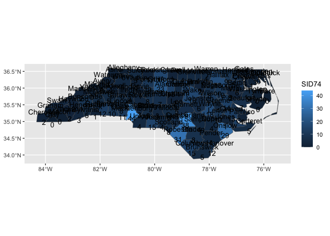

<!-- README.md is generated from README.Rmd. Please edit that file -->

# 0\. ggnorthcarolina

## Installation

You can install the development version of ggnorthcarolina from
[GitHub](https://github.com/) with:

``` r
# install.packages("devtools")
devtools::install_github("EvaMaeRey/ggnorthcarolina")
```

## Example

This is a basic example which shows you how to solve a common problem of
working with North Carolina county characteristics data, and wanting to
map that data, but not having boundary files on hand or not wanting to
think about their preparation.

Here’s some info about NC counties in a data frame; it has no boundary
info.

``` r
library(tidyverse)
#> ── Attaching core tidyverse packages ──────────────────────── tidyverse 2.0.0 ──
#> ✔ dplyr     1.1.0     ✔ readr     2.1.4
#> ✔ forcats   1.0.0     ✔ stringr   1.5.0
#> ✔ ggplot2   3.4.1     ✔ tibble    3.2.0
#> ✔ lubridate 1.9.2     ✔ tidyr     1.3.0
#> ✔ purrr     1.0.1     
#> ── Conflicts ────────────────────────────────────────── tidyverse_conflicts() ──
#> ✖ dplyr::filter() masks stats::filter()
#> ✖ dplyr::lag()    masks stats::lag()
#> ℹ Use the conflicted package (<http://conflicted.r-lib.org/>) to force all conflicts to become errors
library(ggnorthcarolina)
northcarolina_flat %>% head()
#>    AREA PERIMETER CNTY_ CNTY_ID        NAME  FIPS FIPSNO CRESS_ID BIR74 SID74
#> 1 0.114     1.442  1825    1825        Ashe 37009  37009        5  1091     1
#> 2 0.061     1.231  1827    1827   Alleghany 37005  37005        3   487     0
#> 3 0.143     1.630  1828    1828       Surry 37171  37171       86  3188     5
#> 4 0.070     2.968  1831    1831   Currituck 37053  37053       27   508     1
#> 5 0.153     2.206  1832    1832 Northampton 37131  37131       66  1421     9
#> 6 0.097     1.670  1833    1833    Hertford 37091  37091       46  1452     7
#>   NWBIR74 BIR79 SID79 NWBIR79
#> 1      10  1364     0      19
#> 2      10   542     3      12
#> 3     208  3616     6     260
#> 4     123   830     2     145
#> 5    1066  1606     3    1197
#> 6     954  1838     5    1237
```

With ggnorthcarolina, voila, choropleth\!

``` r
library(ggnorthcarolina)
library(ggplot2)
northcarolina_flat %>%
ggplot() +
  aes(fips = FIPS) +
  geom_sf_countynorthcarolina() ->
A

last_plot() + 
  aes(fill = BIR74) ->
B

library(patchwork)
A + B
#> Joining with `by = join_by(fips)`
#> Joining with `by = join_by(fips)`
```



By declaring the aesthetic fips, the geom\_ function joins the flat file
to boundary data and an SF layer is plotted.

We also make labeling these polygons easy:

``` r
northcarolina_flat %>%
ggplot() +
aes(fips = FIPS, 
    fill = SID74,
    label = paste0(NAME, "\n", SID74)) +
  geom_sf_countynorthcarolina() +
  geom_label_northcarolina_county(
    lineheight = .7,
    size = 2, 
    check_overlap= TRUE,
    color = "oldlace")
#> Joining with `by = join_by(fips)`
#> Joining with `by = join_by(fips)`
```


<!-- badges: start -->

<!-- badges: end -->

# 1\. Using ggnorthcarolina as a package-building reference

The second-order goal of ggnorthcarolina is to serve as a model and
template for other ggplot-based geography-specific convenience mapping
packages.

## A. Shape file pre-step

A prerequisite to embarking on the following journey is that you have
geographic data that you’d like to connect up to a flat file for mapping
with ggplot2. In our case, for convenience, we use nc.shp provided in
the sf package. You’ll see that file read in as an sf object later with
the following code:

    st_read(system.file("shape/nc.shp", package="sf")) 

Now, let’s look at the package contents.

``` r
fs::dir_tree(recurse = F)
#> .
#> ├── DESCRIPTION
#> ├── NAMESPACE
#> ├── R
#> ├── README.Rmd
#> ├── README.md
#> ├── data
#> ├── data-raw
#> ├── ggnorthcarolina.Rproj
#> └── man
```

If you’ve done any package building before the components will be
familiar. However, to replicate the functionality for other geographic
regions (i.e. changing out North Carolina), we’ll need to examine the
data-raw and R folders are where all the creative action happens.

``` r
fs::dir_tree(path = "data-raw", recurse = F)
#> data-raw
#> └── DATASET.R
fs::dir_tree(path = "R", recurse = F)
#> R
#> ├── data.R
#> ├── geom_county.R
#> ├── geom_county_labels.R
#> ├── stamp_county.R
#> └── utils-pipe.R
```

# B Prepare reference datasets.

The functions that you create in the R folder will use data that is
prepared in the ./data-raw/DATASET.R file. Let’s have a look at the
contents of that file to get a sense of the preparation. Functions in
the {ggnc} package will help you prepare the reference data that is
required. Keep an eye out for `ggnc::create_geometries_reference()` and
`ggnc::prepare_polygon_labeling_data()`.

ggnc is available on git hub as shown:

``` r
remotes::install_github("EvaMaeRey/ggnc")
```

## B.i dataset build ./data-raw/DATASET.R

``` r
## code to prepare `DATASET` dataset goes here


###### 0. Read in shape file data  #####

library(sf)
northcarolina_county_sf <- st_read(system.file("shape/nc.shp", package="sf")) |>
  dplyr::rename(county_name = NAME,
                fips = FIPS)

### save as is if desired #####
usethis::use_data(northcarolina_county_sf, overwrite = TRUE)


#### 1, create polygon reference dataframe w xmin, ymin, xmax and ymax and save
northcarolina_county_reference <- northcarolina_county_sf |>
  ggnc::create_geometries_reference(
                            id_cols = c(county_name, fips))

usethis::use_data(northcarolina_county_reference, overwrite = TRUE)


####### 2. create and save flat file for examples, if desired ####

northcarolina_county_sf %>%
  sf::st_drop_geometry() ->
northcarolina_county_flat

usethis::use_data(northcarolina_county_flat, overwrite = TRUE)

############### 3. create polygon centers and labels reference data frame

# county centers for labeling polygons

northcarolina_county_centers <- northcarolina_county_sf |>
  ggnc::prepare_polygon_labeling_data(id_cols = c(county_name, fips))


usethis::use_data(northcarolina_county_centers, overwrite = TRUE)
```

Here are a few rows of each dataset that’s created

``` r
nc_flat %>% head()
#>    AREA PERIMETER CNTY_ CNTY_ID        NAME  FIPS FIPSNO CRESS_ID BIR74 SID74
#> 1 0.114     1.442  1825    1825        Ashe 37009  37009        5  1091     1
#> 2 0.061     1.231  1827    1827   Alleghany 37005  37005        3   487     0
#> 3 0.143     1.630  1828    1828       Surry 37171  37171       86  3188     5
#> 4 0.070     2.968  1831    1831   Currituck 37053  37053       27   508     1
#> 5 0.153     2.206  1832    1832 Northampton 37131  37131       66  1421     9
#> 6 0.097     1.670  1833    1833    Hertford 37091  37091       46  1452     7
#>   NWBIR74 BIR79 SID79 NWBIR79
#> 1      10  1364     0      19
#> 2      10   542     3      12
#> 3     208  3616     6     260
#> 4     123   830     2     145
#> 5    1066  1606     3    1197
#> 6     954  1838     5    1237
northcarolina_county_reference %>% head()
#>   county_name  fips      xmin     ymin      xmax     ymax
#> 1        Ashe 37009 -81.74107 36.23436 -81.23989 36.58965
#> 2   Alleghany 37005 -81.34754 36.36536 -80.90344 36.57286
#> 3       Surry 37171 -80.96577 36.23388 -80.43531 36.56521
#> 4   Currituck 37053 -76.33025 36.07282 -75.77316 36.55716
#> 5 Northampton 37131 -77.90121 36.16277 -77.07531 36.55629
#> 6    Hertford 37091 -77.21767 36.23024 -76.70750 36.55629
#>                         geometry
#> 1 MULTIPOLYGON (((-81.47276 3...
#> 2 MULTIPOLYGON (((-81.23989 3...
#> 3 MULTIPOLYGON (((-80.45634 3...
#> 4 MULTIPOLYGON (((-76.00897 3...
#> 5 MULTIPOLYGON (((-77.21767 3...
#> 6 MULTIPOLYGON (((-76.74506 3...
nc_county_centers %>% head()
#>           x        y county_name  fips
#> 1 -81.49496 36.42112        Ashe 37009
#> 2 -81.13241 36.47396   Alleghany 37005
#> 3 -80.69280 36.38828       Surry 37171
#> 4 -75.93852 36.30697   Currituck 37053
#> 5 -77.36988 36.35211 Northampton 37131
#> 6 -77.04217 36.39709    Hertford 37091
```

## B.ii dataset documentation ./R/data.R

Now you’ll also want to document that data in ./R/data.R as shown

``` r
#' World Health Organization TB data
#'
#' A subset of data from the World Health Organization Global Tuberculosis
#' Report ...
#'
#' @format ## `who`
#' A data frame with 7,240 rows and 60 columns:
#' \describe{
#'   \item{country}{Country name}
#'   \item{iso2, iso3}{2 & 3 letter ISO country codes}
#'   \item{year}{Year}
#'   ...
#' }
#' @source <https://www.who.int/teams/global-tuberculosis-programme/data>
"northcarolina_county_sf"

#' World Health Organization TB data
#'
#' A subset of data from the World Health Organization Global Tuberculosis
#' Report ...
#'
#' @format ## `who`
#' A data frame with 7,240 rows and 60 columns:
#' \describe{
#'   \item{country}{Country name}
#'   \item{iso2, iso3}{2 & 3 letter ISO country codes}
#'   \item{year}{Year}
#'   ...
#' }
#' @source <https://www.who.int/teams/global-tuberculosis-programme/data>
"northcarolina_county_flat"


#' World Health Organization TB data
#'
#' A subset of data from the World Health Organization Global Tuberculosis
#' Report ...
#'
#' @format ## `who`
#' A data frame with 7,240 rows and 60 columns:
#' \describe{
#'   \item{country}{Country name}
#'   \item{iso2, iso3}{2 & 3 letter ISO country codes}
#'   \item{year}{Year}
#'   ...
#' }
#' @source <https://www.who.int/teams/global-tuberculosis-programme/data>
"northcarolina_county_centers"

#' World Health Organization TB data
#'
#' A subset of data from the World Health Organization Global Tuberculosis
#' Report ...
#'
#' @format ## `who`
#' A data frame with 7,240 rows and 60 columns:
#' \describe{
#'   \item{country}{Country name}
#'   \item{iso2, iso3}{2 & 3 letter ISO country codes}
#'   \item{year}{Year}
#'   ...
#' }
#' @source <https://www.who.int/teams/global-tuberculosis-programme/data>
"northcarolina_county_reference"
```

# B. Prepare functions for building polygons defined by ids

## ./R/geom.R

``` r
################# Compute panel function ###########

#' Title
#'
#' @param data
#' @param scales
#' @param keep_county
#'
#' @return
#' @export
#'
#' @examples
#' library(dplyr)
#' #northcarolina_flat |> rename(fips = FIPS) |> compute_county_northcarolina() |> head()
#' #northcarolina_flat |> rename(fips = FIPS) |> compute_county_northcarolina(keep_county = "Ashe")
compute_county_northcarolina <- function(data, scales, keep_county = NULL){

  reference_filtered <- northcarolina_county_reference
  #
  if(!is.null(keep_county)){

    keep_county %>% tolower() -> keep_county

    reference_filtered %>%
      dplyr::filter(.data$county_name %>%
                      tolower() %in%
                      keep_county) ->
      reference_filtered

  }

  # to prevent overjoining
  reference_filtered %>%
    dplyr::select("fips", "geometry", "xmin",
                  "xmax", "ymin", "ymax") ->
    reference_filtered


  data %>%
    dplyr::inner_join(reference_filtered) %>% # , by = join_by(fips)
    dplyr::mutate(group = -1) %>%
    dplyr::select(-fips) #%>%
    # sf::st_as_sf() %>%
    # sf::st_transform(crs = 5070)

}


###### Specify ggproto ###############

StatCountynorthcarolina <- ggplot2::ggproto(`_class` = "StatCountynorthcarolina",
                               `_inherit` = ggplot2::Stat,
                               compute_panel = compute_county_northcarolina,
                               default_aes = ggplot2::aes(geometry =
                                                            ggplot2::after_stat(geometry)))


########### geom function, inherits from sf ##################

#' Title
#'
#' @param mapping
#' @param data
#' @param position
#' @param na.rm
#' @param show.legend
#' @param inherit.aes
#' @param ...
#'
#' @return
#' @export
#'
#' @examples
#' library(ggplot2)
#' northcarolina_flat %>%
#' ggplot() +
#' aes(fips = FIPS) +
#' geom_sf_countynorthcarolina()
geom_sf_countynorthcarolina <- function(
                                 mapping = NULL,
                                 data = NULL,
                                 position = "identity",
                                 na.rm = FALSE,
                                 show.legend = NA,
                                 inherit.aes = TRUE,
                                 crs = "NAD27", # "NAD27", 5070, "WGS84", "NAD83", 4326 , 3857
                                 ...
                                 ) {

                                 c(ggplot2::layer_sf(
                                   stat = StatCountynorthcarolina,  # proto object from step 2
                                   geom = ggplot2::GeomSf,  # inherit other behavior
                                   data = data,
                                   mapping = mapping,
                                   position = position,
                                   show.legend = show.legend,
                                   inherit.aes = inherit.aes,
                                   params = rlang::list2(na.rm = na.rm, ...)),
                                   coord_sf(crs = crs,
                                            default_crs = sf::st_crs(crs),
                                            datum = crs,
                                            default = TRUE)
                                 )

}
```

## ./R/stamp.R

``` r
#' Title
#'
#' @param data
#' @param scales
#' @param county
#'
#' @return
#' @export
#'
#' @examples
#' library(dplyr)
#' #northcarolina_flat |> rename(fips = FIPS) |> compute_county_northcarolina() |> head() |> str()
#' #northcarolina_flat |> rename(fips = FIPS) |> compute_county_northcarolina(keep_county = "Ashe")
compute_county_northcarolina_stamp <- function(data, scales, keep_county = NULL){

  reference_filtered <- northcarolina_county_reference
  #
  if(!is.null(keep_county)){

    keep_county %>% tolower() -> keep_county

    reference_filtered %>%
      dplyr::filter(.data$county_name %>%
                      tolower() %in%
                      keep_county) ->
      reference_filtered

  }

  reference_filtered %>%
    dplyr::select("fips", "geometry", "xmin",
                  "xmax", "ymin", "ymax") ->
    reference_filtered


  reference_filtered %>%
    dplyr::mutate(group = -1) %>%
    dplyr::select(-fips)

}


StatCountynorthcarolinastamp <- ggplot2::ggproto(`_class` = "StatCountynorthcarolinastamp",
                               `_inherit` = ggplot2::Stat,
                               compute_panel = compute_county_northcarolina_stamp,
                               default_aes = ggplot2::aes(geometry =
                                                            ggplot2::after_stat(geometry)))


#' Title
#'
#' @param mapping
#' @param data
#' @param position
#' @param na.rm
#' @param show.legend
#' @param inherit.aes
#' @param ...
#'
#' @return
#' @export
#'
#' @examples
#' library(ggplot2)
#' ggplot() +
#' stamp_sf_countynorthcarolina()
stamp_sf_countynorthcarolina <- function(
                                 mapping = NULL,
                                 data = reference_full,
                                 position = "identity",
                                 na.rm = FALSE,
                                 show.legend = NA,
                                 inherit.aes = TRUE,
                                 crs = "NAD27", #WGS84, NAD83
                                 ...
                                 ) {

                                 c(ggplot2::layer_sf(
                                   stat = StatCountynorthcarolinastamp,  # proto object from step 2
                                   geom = ggplot2::GeomSf,  # inherit other behavior
                                   data = data,
                                   mapping = mapping,
                                   position = position,
                                   show.legend = show.legend,
                                   inherit.aes = inherit.aes,
                                   params = rlang::list2(na.rm = na.rm, ...)),
                                   coord_sf(crs = crs,
                                            # default_crs = sf::st_crs(crs),
                                            # datum = sf::st_crs(crs),
                                            default = TRUE)
                                 )

}
```

### Changing context

Here is a suggested preparation for a package for allowing for
ggbrasilstates easy creation of brazilian state choropleth, reading in
an sf states object from the geombr package.

    brasil_state_sf <- geobr::read_state() %>%
      rename(state_code = code_state,
             state_abb = abbrev_state,
             state = name_state,
             region_code = code_region,
             region = name_region,
             geometry = geom)# year 2010

Then a number of changes would need to be made to update the DATASET.R
file, including object names. Also notably there are quite a few columns
that are ID columns compared to the North Carolina case.

Find and change can be used for object name changes.

    id_cols = c(county_name, fips) -> id_cols = c(state_code, state_abb, state, region_code, region)
    county -> state
    northcarolina -> brasil

## ./R/labels.R

``` r
# step 00 reference data
# northcarolina_county_centers <- data.frame(     x   =  -81.49496,   y = 36.42112,  county_name = "Ashe",   fips = "37009")


# step 1
#' Title
#'
#' @param data
#' @param scales
#' @param keep_county
#'
#' @return
#' @export
#'
#' @examples
#' northcarolina_flat |>
#'   dplyr::rename(fips = FIPS) |>
#'   dplyr::rename(label = NAME) |>
#'   compute_panel_county_centers()
compute_panel_county_centers <- function(data,
                                         scales,
                                         keep_county = NULL){

  northcarolina_county_centers_filtered <- northcarolina_county_centers

  if(!is.null(keep_county)){
    keep_county %>% tolower() -> keep_county

    northcarolina_county_centers_filtered %>%
      dplyr::filter(.data$county_name %>%
                      tolower() %in%
                      keep_county) ->
      northcarolina_county_centers_filtered}

  data %>%
    dplyr::inner_join(northcarolina_county_centers_filtered) %>%
    dplyr::select(x, y, label)

}


# step 2 proto
StatCountycenters <- ggplot2::ggproto(
  `_class` = "StatRownumber",
  `_inherit` = ggplot2::Stat,
  # required_aes = c("label"), # for some reason this breaks things... why?
  compute_panel = compute_panel_county_centers
)

#' Title
#'
#' @param mapping
#' @param data
#' @param position
#' @param na.rm
#' @param show.legend
#' @param inherit.aes
#' @param ...
#'
#' @return
#' @export
#'
#' @examples
#' library(ggplot2)
#' northcarolina_flat %>%
#'  ggplot() +
#'  aes(fips = FIPS, label = NAME) +
#'  geom_label_northcarolina_county()
#'
#' northcarolina_flat %>%
#'  ggplot() +
#'  aes(fips = FIPS, label = NAME) +
#'  geom_sf_countynorthcarolina() +
#'  geom_label_northcarolina_county()
#'
#'  northcarolina_flat %>%
#'  ggplot() +
#'  aes(fips = FIPS, label = SID74, fill = SID74) +
#'  geom_sf_countynorthcarolina() +
#'  geom_label_northcarolina_county(color = "oldlace")
#'
#'  northcarolina_flat %>%
#'  ggplot() +
#'  aes(fips = FIPS, fill = SID74,
#'      label = paste0(NAME, "\n", SID74)) +
#'  geom_sf_countynorthcarolina() +
#'  geom_label_northcarolina_county(lineheight = .7,
#'  size = 2, check_overlap= TRUE,
#'  color = "oldlace")
geom_label_northcarolina_county <- function(
  mapping = NULL,
  data = NULL,
  position = "identity",
  na.rm = FALSE,
  show.legend = NA,
  inherit.aes = TRUE, ...) {
  ggplot2::layer(
    stat = StatCountycenters,  # proto object from Step 2
    geom = ggplot2::GeomText,  # inherit other behavior
    data = data,
    mapping = mapping,
    position = position,
    show.legend = show.legend,
    inherit.aes = inherit.aes,
    params = list(na.rm = na.rm, ...)
  )
}
```

For ggbrasil in these files changes should be made:

    County -> State

New examples should be crafted.
